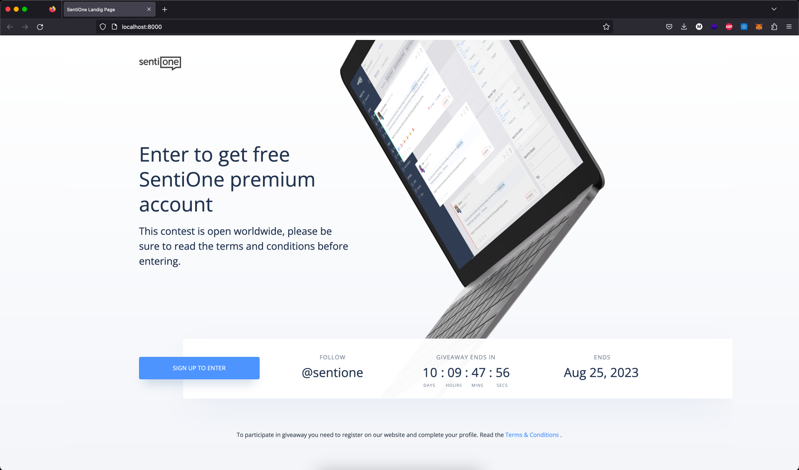

# SentiOne Landing Page - wordpress task

## Technologies:

- figma
- wordpress
- html, css, vanilla js
- docker
- bash

## How to use it:

- clone repo: <code>git clone https://github.com/kezzlock/senti1-lp-wordpress.git</code>
- go to senti1-lp-wordpress folder: <code>cd senti1-lp-wordpress</code>
- go to the development folder: <code>cd development</code>
- run docker image: <code>docker-compose up --build</code>
- go to your webrowser: <code>http://localhost:8000</code>
- install Wordpress
- activate the theme

## Thank you
